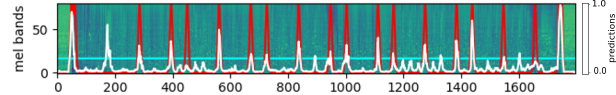

# MUSIC BOUNDARIES DETECTION (STRUCTURE SEGMENTATION)
Code repository for the paper *Music Boundary Detection using Convolutional Neural Networks: A comparative analysis of 
combined input features*.
See [arXiv preprint](https://arxiv.org/pdf/2008.07527.pdf)
Currently being reviewed in the *International Journal of
Interactive Multimedia
and Artifcial Intelligence* Journal.


## Introduction
Music Structure Segmentation is a research part in Music Information Retrieval (MIR). Since 2009, MIREX's campaigns have 
been tested this algorithms which are composed by unsupervised and supervised neural networks methods. This methods take 
as inputs audio features such as MFCCs, chroma vectors or spectrograms, and the well-known self-similarity (lag) matrices
SSM or SSLM.

Check [SelfSimilarityMatrices repository](https://github.com/carlosholivan/SelfSimilarityMatrices) and see the notebooks 
to follow the procedure of the inputs (SSLMs) calculation step by step.



## TODOs

- [ ] Fix Training script
- [ ] Fix Evaluation script
- [ ] Make a test script where an audio file is taken and the prediction is given as the output

## Package Structure

[*boundariesdetectioncnn/*](boundariesdetectioncnn/)<br/>
&nbsp;&nbsp;&nbsp;&nbsp;module containing VAE architecture, training and data uitilities.

[*boundariesdetectioncnn/models*](boundariesdetectioncnn/models)<br/>
&nbsp;&nbsp;&nbsp;&nbsp;CNN models.

[*boundariesdetectioncnn/data*](boundariesdetectioncnn/data)<br/>
&nbsp;&nbsp;&nbsp;&nbsp;data handling tools.

[*boundariesdetectioncnn/train*](boundariesdetectioncnn/train)<br/>
&nbsp;&nbsp;&nbsp;&nbsp;model training tools.

[*boundariesdetectioncnn/evaluation*](boundariesdetectioncnn/evaluation)<br/>
&nbsp;&nbsp;&nbsp;&nbsp;model evaluation tools.

[*notebooks/*](notebooks/)<br/>
&nbsp;&nbsp;&nbsp;&nbsp;tutorial notebooks.

[*tests/*](tests/)<br/>
&nbsp;&nbsp;&nbsp;&nbsp;unit tests.


## Installation

```
cd .path/to/timbre-vae
python setup.py install
```


## Prerequisites

Python 3.5 or later. In Ubuntu, Mint and Debian Python 3 can be installed like this:

```
sudo apt-get install python3 python3-pip
```

[Librosa 0.7.2](https://librosa.github.io/librosa/install.html)

```
sudo pip install librosa
```

If you use conda/Anaconda environments, librosa can be installed from the conda-forge channel:

```
conda install -c conda-forge librosa
```

## Databases

Here is a list of the databases that are used in Music Structural Analysis. This model has been trained, evaluated and tested with SALAMI 2.0 dataset.

### RCW Database

RCW Goto Annotations: http://staff.aist.go.jp/m.goto/RWC-MDB/AIST-Annotation

RCW Quaero Project Annotations (MIREX10): http://musicdata.gforge.inria.fr/

### Beatles Database

Beatles-TUT Annotations: http://www.cs.tut.fi/sgn/arg/paulus/beatles_sections_TUT.zip

Isophonic Beatles or Beatles-ISO Annotations: http://isophonics.net/content/reference-annotations

### SALAMI 2.0 Database

2.0 version: https://ddmal.music.mcgill.ca/research/SALAMI/

## Webs of Interest

[MIREX](https://www.music-ir.org/mirex/wiki/MIREX_HOME )

[MIR](https://musicinformationretrieval.com/)


## References
|   |   |
|---|---|
| [1] |  Cohen-Hadria, A., & Peeters, G. (2017, June). Music structure boundaries estimation using multiple self-similarity matrices as input depth of convolutional neural networks. In *Audio Engineering Society Conference: 2017 AES International Conference on Semantic Audio.* Audio Engineering Society. |
| [2] | Grill, T., & Schlüter, J. (2015, October). Music Boundary Detection Using Neural Networks on Combined Features and Two-Level Annotations. In *ISMIR* (pp. 531-537). |
| [3] | Grill, T., & Schluter, J. (2015, August). Music boundary detection using neural networks on spectrograms and self-similarity lag matrices. In *2015 23rd European Signal Processing Conference (EUSIPCO)* (pp. 1296-1300). IEEE. |
| [4] | Serra, J., Müller, M., Grosche, P., & Arcos, J. L. (2012, July). Unsupervised detection of music boundaries by time series structure features. In *Proceedings of the AAAI Conference on Artificial Intelligence* (Vol. 26, No. 1). |


## Authors

* [**Carlos Hernández**](https://carlosholivan.github.io/index.html) - carloshero@unizar.es
* **David Díaz-Guerra** - ddga@uniza.es
* **José Ramón Beltrán** - jrbelbla@unizar.es

